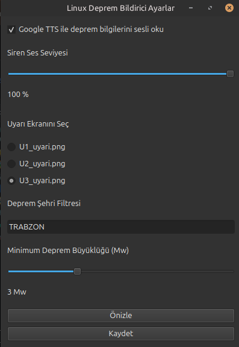

# 🌍 Linux Deprem Bildirici

**Linux Deprem Bildirici**, Kandilli Rasathanesi (KOERI) verilerini kullanarak belirlediğiniz şehir ve büyüklük filtresine göre **gerçek zamanlı deprem uyarıları** veren, sistem tepsisinde (tray) çalışan bir Linux uygulamasıdır.

Deprem algılandığında:  
- 🔊 Siren çalar  
- 🗣️ Google TTS ile sesli uyarı verir  
- 🖥️ Tam ekran görsel uyarı gösterir  

Uygulama **Ubuntu / Debian tabanlı** sistemlerle uyumludur.

---

## ✨ Özellikler

- 📡 Kandilli Rasathanesi canlı deprem verileri  
- 🏙️ Şehir filtresi (**Şehir filtresi yazarken, yazdığınız şehir Türkçe karakter içeriyorsa, Türkçe karakter olmadan yazınız. Kandilli verilerinde şehir isimleri, Türkçe karakter olmadan yazılır. Türkçe karakter ile yazarsanız; HİÇ BİR deprem bildirimi alamazsınız.** örn: İSTANBUL <YANLIŞTIR> || ISTANBUL <DOĞRUDUR>)  
- 📏 Minimum büyüklük filtresi (örn: **Mw ≥ 3.0**)  
- 🔔 Tam ekran deprem uyarısı  
- 🖼️ Değiştirilebilir uyarı tasarımları  
- 🔊 Ayarlanabilir siren sesi  
- 🗣️ Google TTS ile Türkçe sesli uyarı  
- 🧭 Sistem tepsisinde (tray) çalışma  
- ⚙️ Grafik ayarlar menüsü  
- 🧪 Test uyarısı  
- 🚀 Bilgisayar açılışında otomatik başlatma (systemd user service)  

---

## 🖥️ Ekran Görüntüleri
Ekrana uyarının nasıl geldiğini  seyredebilirsiniz.




---

## 📦 Kurulum (GUI – Önerilen)

### Gereksinimler

- Python 3.10 veya üzeri  
- Linux (Ubuntu / Debian)  
- İnternet bağlantısı  

### Kurulum Adımları

```bash
git clone https://github.com/miracthedevv/linuxdeprem.git
cd linuxdeprem
python3 setup_gui.py
```
Kurulum tamamlandıktan sonra:

- Uygulama otomatik olarak çalışır
- Sistem tepsisinde (sağ alt) ikon görünür
- Bilgisayar açılışında otomatik başlar

## 🧭 Kullanım

Tray ikonuna sağ tıklayın:

- Ayarlar
- Test Uyarısı
- Linux Deprem Bildirici'yi Kapat
seçeneklerini görürsünüz.
## ⚙️ Ayarlar

### 🔊 Ses
- Google TTS ile sesli uyarı (aç / kapat)
- Siren ses seviyesi (slider)

### 🖥️ Ekran
- Uyarı ekranı seçimi (U1_uyari.png, U2_uyari.png, U3_uyari.png)

### 📍 Filtreler
- Şehir filtresi (örn: TRABZON)
- Minimum deprem büyüklüğü (Mw)

## 📡 Çalışma Mantığı
Kandilli Rasathanesi’nin son deprem listesi düzenli olarak kontrol edilir
Sadece en son (ilk satırdaki) deprem değerlendirilir

- Eğer:
-- Deprem belirtilen şehirdeyse
-- Büyüklük filtresini geçiyorsa
→ Uyarı tetiklenir

Aksi durumda hiçbir uyarı verilmez

## 🧪 Test Uyarısı
### Gerçek deprem olmadan sistemi test etmek için:
Tray → Test Uyarısı

## 🔐 Güvenlik & Gizlilik
- Kişisel veri toplanmaz
- Sadece herkese açık Kandilli verileri kullanılır
- Sunucuya veri gönderilmez
- Uygulama tamamen yerel çalışır

## 🗑️ Kaldırma (Manuel)
```bash
systemctl --user stop linux-deprem-bildirici
systemctl --user disable linux-deprem-bildirici
rm -rf ~/.local/share/linux-deprem-bildirici
rm ~/.config/systemd/user/linux-deprem-bildirici.service
```

## 🛠️ Kullanılan Teknolojiler

-Python
-pygame
-PyQt6
-pystray
-gTTS (Google Text-to-Speech)
-systemd (user service)

## 📄 Lisans

**MIT License**
Bu proje özgür yazılımdır. Dilediğiniz gibi kullanabilir, değiştirebilir ve paylaşabilirsiniz.

## 🤝 Katkı
Katkılara açıktır:
Hata bildirmek için Issues
Geliştirme için Pull Request

## ⭐ Destek

Projeyi beğendiyseniz GitHub’da ⭐(star) vermeyi unutmayın.
# **Depreme karşı bilinç hayat kurtarır.**
2026 miracthedev.
